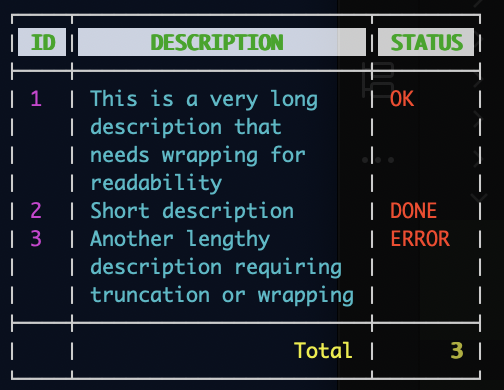

# Table Writer for Go

[](https://github.com/olekukonko/tablewriter/actions?query=workflow%3Aci)
[](https://sourcegraph.com/github.com/olekukonko/tablewriter)
[](https://godoc.org/github.com/olekukonko/tablewriter)

`tablewriter` is a powerful Go library for generating formatted text-based tables, supporting ASCII, HTML, Markdown, and colorized outputs. It is ideal for command-line tools, logs, or web applications. The `prototype` branch (targeting `v0.2.0`) introduces modern features like generics, streaming, and advanced cell merging.

> **Note**: For legacy support (stable `v0.0.5`), refer to [README_LEGACY.md](README_LEGACY.md). This README documents the `main` branch.

## Features

- **Multiple Renderers**: ASCII, Unicode, Markdown, HTML, or colorized outputs.
- **Flexible Configuration**: Customize alignment, padding, wrapping, borders, and separators.
- **Cell Merging**: Horizontal, vertical, and hierarchical merging for compact layouts.
- **Multiline Cells**: Automatic wrapping or truncation of multiline content.
- **CSV Input**: Create tables from CSV files or `io.Reader` streams.
- **Streaming Support**: Render large datasets row-by-row with `TableStream`.
- **Colorized Output**: Apply ANSI colors to headers, rows, footers, and borders.
- **Struct Input**: Render tables from structs using custom stringer functions.
- **io.Writer Support**: Write to `os.Stdout`, files, or `strings.Builder`.
- **Content Filtering**: Mask sensitive data (e.g., emails, passwords).

## Installation

```bash
go get github.com/olekukonko/tablewriter
```

## Usage

Create a table with `NewTable` or `NewWriter`, configure it using options or a `Config` struct, add data with `Append` or `Bulk`, and render to an `io.Writer`. Use renderers like `Blueprint` (ASCII), `HTML`, `Markdown`, `Colorized`, or `Ocean` (streaming).

## Examples

### Basic Examples

#### 1. Simple ASCII Table

Create a basic ASCII table with headers and rows.

```go
package main

import (
	"fmt"
	"github.com/olekukonko/tablewriter"
	"os"
)

type Age int

func (a Age) String() string {
	return fmt.Sprintf("%d yrs", a)
}

func main() {
	data := [][]any{
		{"Alice", Age(25), "New York"},
		{"Bob", Age(30), "Boston"},
	}

	table := tablewriter.NewTable(os.Stdout)
	table.Header([]string{"Name", "Age", "City"})
	table.Bulk(data)
	table.Render()
}
```

**Output**:

```
┌───────┬────────┬──────────┐
│ NAME  │  AGE   │   CITY   │
├───────┼────────┼──────────┤
│ Alice │ 25 yrs │ New York │
│ Bob   │ 30 yrs │ Boston   │
└───────┴────────┴──────────┘

```

#### 2. Markdown Table

Generate a Markdown table for documentation.

```go
package main

import (
	"fmt"
	"github.com/olekukonko/tablewriter"
	"github.com/olekukonko/tablewriter/renderer"
	"os"
	"strings"
	"unicode"
)

type Name struct {
	First string
	Last  string
}

// this will be ignored since  Format() is present
func (n Name) String() string {
	return fmt.Sprintf("%s %s", n.First, n.Last)
}

// Note: Format() overrides String() if both exist.
func (n Name) Format() string {
	return fmt.Sprintf("%s %s", n.clean(n.First), n.clean(n.Last))
}

// clean ensures the first letter is capitalized and the rest are lowercase
func (n Name) clean(s string) string {
	s = strings.TrimSpace(strings.ToLower(s))
	words := strings.Fields(s)
	s = strings.Join(words, "")

	if s == "" {
		return s
	}
	// Capitalize the first letter
	runes := []rune(s)
	runes[0] = unicode.ToUpper(runes[0])
	return string(runes)
}

type Age int

// Age int will be ignore and string will be used
func (a Age) String() string {
	return fmt.Sprintf("%d yrs", a)
}

func main() {
	data := [][]any{
		{Name{"Al  i  CE", " Ma  SK"}, Age(25), "New York"},
		{Name{"bOb", "mar   le   y"}, Age(30), "Boston"},
	}

	table := tablewriter.NewTable(os.Stdout,
		tablewriter.WithRenderer(renderer.NewMarkdown()),
	)

	table.Header([]string{"Name", "Age", "City"})
	table.Bulk(data)
	table.Render()
}
```

**Output**:

```
|    NAME    |  AGE   |   CITY   |
|:----------:|:------:|:--------:|
| Alice Mask | 25 yrs | New York |
| Bob Marley | 30 yrs | Boston   |


```

#### 3. CSV Input

Create a table from a CSV file with custom row alignment.

```go
package main

import (
	"github.com/olekukonko/tablewriter"
	"github.com/olekukonko/tablewriter/tw"
	"log"
	"os"
)

func main() {
	// Assuming "test.csv" contains: "First Name,Last Name,SSN\nJohn,Barry,123456\nKathy,Smith,687987"
	table, err := tablewriter.NewCSV(os.Stdout, "test.csv", true)
	if err != nil {
		log.Fatalf("Error: %v", err)
	}

	table.Configure(func(config *tablewriter.Config) {
		config.Row.Formatting.Alignment = tw.AlignLeft
	})
	table.Render()
}
```

**Output**:

```
┌────────────┬───────────┬─────────┐
│ FIRST NAME │ LAST NAME │   SSN   │
├────────────┼───────────┼─────────┤
│ John       │ Barry     │ 123456  │
│ Kathy      │ Smith     │ 687987  │
└────────────┴───────────┴─────────┘
```

### Advanced Examples

#### 4. Colorized Table with Long Values

Create a colorized table with wrapped long values, per-column colors, and a styled footer (inspired by `TestColorizedLongValues` and `TestColorizedCustomColors`).

```go
package main

import (
	"github.com/fatih/color"
	"github.com/olekukonko/tablewriter"
	"github.com/olekukonko/tablewriter/renderer"
	"github.com/olekukonko/tablewriter/tw"
	"os"
)

func main() {
	data := [][]string{
		{"1", "This is a very long description that needs wrapping for readability", "OK"},
		{"2", "Short description", "DONE"},
		{"3", "Another lengthy description requiring truncation or wrapping", "ERROR"},
	}

	// Configure colors: green headers, cyan/magenta rows, yellow footer
	colorCfg := renderer.ColorizedConfig{
		Header: renderer.Tint{
			FG: renderer.Colors{color.FgGreen, color.Bold}, // Green bold headers
			BG: renderer.Colors{color.BgHiWhite},
		},
		Column: renderer.Tint{
			FG: renderer.Colors{color.FgCyan}, // Default cyan for rows
			Columns: []renderer.Tint{
				{FG: renderer.Colors{color.FgMagenta}}, // Magenta for column 0
				{},                                     // Inherit default (cyan)
				{FG: renderer.Colors{color.FgHiRed}},   // High-intensity red for column 2
			},
		},
		Footer: renderer.Tint{
			FG: renderer.Colors{color.FgYellow, color.Bold}, // Yellow bold footer
			Columns: []renderer.Tint{
				{},                                      // Inherit default
				{FG: renderer.Colors{color.FgHiYellow}}, // High-intensity yellow for column 1
				{},                                      // Inherit default
			},
		},
		Border:    renderer.Tint{FG: renderer.Colors{color.FgWhite}}, // White borders
		Separator: renderer.Tint{FG: renderer.Colors{color.FgWhite}}, // White separators
	}

	table := tablewriter.NewTable(os.Stdout,
		tablewriter.WithRenderer(renderer.NewColorized(colorCfg)),
		tablewriter.WithConfig(tablewriter.Config{
			Row: tw.CellConfig{
				Formatting: tw.CellFormatting{
					MaxWidth:  25,            // Limit column width
					AutoWrap:  tw.WrapNormal, // Wrap long content
					Alignment: tw.AlignLeft,  // Left-align rows
				},
			},
			Footer: tw.CellConfig{
				Formatting: tw.CellFormatting{Alignment: tw.AlignRight},
			},
		}),
	)

	table.Header([]string{"ID", "Description", "Status"})
	table.Bulk(data)
	table.Footer([]string{"", "Total", "3"})
	table.Render()
}
```

**Output** (colors visible in ANSI-compatible terminals):



#### 5. Streaming Table with Truncation

Stream a table incrementally with truncation and a footer, simulating a real-time data feed (inspired by `TestOceanStreamTruncation` and `TestOceanStreamSlowOutput`).

```go
package main

import (
	"github.com/olekukonko/tablewriter"
	"github.com/olekukonko/tablewriter/streamer"
	"github.com/olekukonko/tablewriter/tw"
	"log"
	"os"
	"time"
)

func main() {
	// Configure Ocean streamer with fixed widths
	oceanCfg := streamer.OceanConfig{
		ColumnWidths:   []int{4, 15, 8}, // ID: 4, Desc: 15, Status: 8
		ColumnAligns:   []tw.Align{tw.AlignCenter, tw.AlignLeft, tw.AlignRight},
		HeaderAlign:    tw.AlignCenter,
		FooterAlign:    tw.AlignRight,
		ShowHeaderLine: true,
		ShowFooterLine: true,
	}

	// Create streamer
	oceanRenderer, err := streamer.NewOcean(os.Stdout, false, oceanCfg)
	if err != nil {
		log.Fatalf("Failed to create renderer: %v", err)
	}
	tableStream, err := tablewriter.NewStreamTable(os.Stdout, oceanRenderer)
	if err != nil {
		log.Fatalf("Failed to create TableStream: %v", err)
	}

	// Start streaming
	if err := tableStream.Start(); err != nil {
		log.Fatalf("Start failed: %v", err)
	}

	// Stream header
	tableStream.Header([]string{"ID", "Description", "Status"})

	// Stream rows with simulated delay
	data := [][]string{
		{"1", "This description is too long", "OK"},
		{"2", "Short desc", "DONE"},
		{"3", "Another long description here", "ERROR"},
	}
	for i, row := range data {
		if err := tableStream.Row(row); err != nil {
			log.Fatalf("Row %d failed: %v", i+1, err)
		}
		time.Sleep(500 * time.Millisecond) // Simulate real-time data feed
	}

	// Stream footer
	tableStream.Footer([]string{"", "Total", "3"})

	// End streaming
	if err := tableStream.End(); err != nil {
		log.Fatalf("End failed: %v", err)
	}
}
```

**Output** (appears incrementally):

```
┌────┬───────────────┬────────┐
│ ID │  DESCRIPTION  │ STATUS │
├────┼───────────────┼────────┤
│ 1  │ This descri…  │     OK │
│ 2  │ Short desc    │   DONE │
│ 3  │ Another lon…  │  ERROR │
├────┼───────────────┼────────┤
│    │         Total │      3 │
└────┴───────────────┴────────┘
```

**Note**: Long descriptions are truncated with `…` due to fixed column widths. The output appears row-by-row, simulating a real-time feed.

#### 6. Hierarchical Merging for Organizational Data

Show hierarchical merging for a tree-like structure, such as an organizational hierarchy (inspired by `TestMergeHierarchicalUnicode`).

```go
package main

import (
	"github.com/olekukonko/tablewriter"
	"github.com/olekukonko/tablewriter/renderer"
	"github.com/olekukonko/tablewriter/tw"
	"os"
)

func main() {
	data := [][]string{
		{"Engineering", "Backend", "API Team", "Alice"},
		{"Engineering", "Backend", "Database Team", "Bob"},
		{"Engineering", "Frontend", "UI Team", "Charlie"},
		{"Marketing", "Digital", "SEO Team", "Dave"},
		{"Marketing", "Digital", "Content Team", "Eve"},
	}

	table := tablewriter.NewTable(os.Stdout,
		tablewriter.WithRenderer(renderer.NewBlueprint(tw.RendererConfig{
			Settings: tw.Settings{
				Separators: tw.Separators{BetweenRows: tw.On},
			},
		})),
		tablewriter.WithConfig(tablewriter.Config{
			Header: tw.CellConfig{
				Formatting: tw.CellFormatting{Alignment: tw.AlignCenter},
			},
			Row: tw.CellConfig{
				Formatting: tw.CellFormatting{
					MergeMode: tw.MergeHierarchical,
					Alignment: tw.AlignLeft,
				},
			},
		}),
	)
	table.Header([]string{"Department", "Division", "Team", "Lead"})
	table.Bulk(data)
	table.Render()
}
```

**Output**:

```
┌────────────┬──────────┬──────────────┬────────┐
│ DEPARTMENT │ DIVISION │    TEAM      │  LEAD  │
├────────────┼──────────┼──────────────┼────────┤
│ Engineering│ Backend  │ API Team     │ Alice  │
│            │          ├──────────────┼────────┤
│            │          │ Database Team│ Bob    │
│            │ Frontend ├──────────────┼────────┤
│            │          │ UI Team      │ Charlie│
├────────────┼──────────┼──────────────┼────────┤
│ Marketing  │ Digital  │ SEO Team     │ Dave   │
│            │          ├──────────────┼────────┤
│            │          │ Content Team │ Eve    │
└────────────┴──────────┴──────────────┴────────┘
```

**Note**: Hierarchical merging groups repeated values (e.g., "Engineering" spans multiple rows, "Backend" spans two teams), creating a tree-like structure.

#### 7. Custom Padding with Merging

Showcase custom padding and combined horizontal/vertical merging (inspired by `TestMergeWithPadding` in `merge_test.go`).

```go
package main

import (
	"github.com/olekukonko/tablewriter"
	"github.com/olekukonko/tablewriter/renderer"
	"github.com/olekukonko/tablewriter/tw"
	"os"
)

func main() {
	data := [][]string{
		{"1/1/2014", "Domain name", "Successful", "Successful"},
		{"1/1/2014", "Domain name", "Pending", "Waiting"},
		{"1/1/2014", "Domain name", "Successful", "Rejected"},
		{"", "", "TOTAL", "$145.93"},
	}

	table := tablewriter.NewTable(os.Stdout,
		tablewriter.WithRenderer(renderer.NewBlueprint(tw.RendererConfig{
			Settings: tw.Settings{
				Separators: tw.Separators{BetweenRows: tw.On},
			},
		})),
		tablewriter.WithConfig(tablewriter.Config{
			Row: tw.CellConfig{
				Formatting:   tw.CellFormatting{MergeMode: tw.MergeBoth},
				ColumnAligns: []tw.Align{tw.Skip, tw.Skip, tw.AlignRight, tw.AlignLeft},
			},
			Footer: tw.CellConfig{
				Padding: tw.CellPadding{
					Global:    tw.Padding{Left: "*", Right: "*"},
					PerColumn: []tw.Padding{{}, {}, {Bottom: "^"}, {Bottom: "^"}},
				},
				ColumnAligns: []tw.Align{tw.Skip, tw.Skip, tw.AlignRight, tw.AlignLeft},
			},
		}),
	)
	table.Header([]string{"Date", "Description", "Status", "Conclusion"})
	table.Bulk(data)
	table.Render()
}
```

**Output**:

```
┌──────────┬─────────────┬────────────┬────────────┐
│   DATE   │ DESCRIPTION │   STATUS   │ CONCLUSION │
├──────────┼─────────────┼────────────┴────────────┤
│ 1/1/2014 │ Domain name │              Successful │
│          │             ├────────────┬────────────┤
│          │             │    Pending │ Waiting    │
│          │             ├────────────┼────────────┤
│          │             │ Successful │ Rejected   │
├──────────┼─────────────┼────────────┼────────────┤
│          │             │      TOTAL │ $145.93    │
│          │             │^^^^^^^^^^^^│^^^^^^^^^^^^│
└──────────┴─────────────┴────────────┴────────────┘
```

#### 8. Nested Tables

Create a table with nested sub-tables for complex layouts (inspired by `TestMasterClass` in `extra_test.go`).

```go
package main

import (
	"bytes"
	"github.com/olekukonko/tablewriter"
	"github.com/olekukonko/tablewriter/renderer"
	"github.com/olekukonko/tablewriter/tw"
	"os"
)

func main() {
	// Helper to create a sub-table
	createSubTable := func(s string) string {
		var buf bytes.Buffer
		table := tablewriter.NewTable(&buf,
			tablewriter.WithRenderer(renderer.NewBlueprint(tw.RendererConfig{
				Borders: tw.BorderNone,
				Symbols: tw.NewSymbols(tw.StyleASCII),
				Settings: tw.Settings{
					Separators: tw.Separators{BetweenRows: tw.On},
					Lines:      tw.Lines{ShowFooterLine: tw.On},
				},
			})),
			tablewriter.WithConfig(tablewriter.Config{
				MaxWidth: 10,
				Row: tw.CellConfig{
					Formatting: tw.CellFormatting{Alignment: tw.AlignCenter},
				},
			}),
		)
		table.Append([]string{s, s})
		table.Append([]string{s, s})
		table.Render()
		return buf.String()
	}

	// Main table
	table := tablewriter.NewTable(os.Stdout,
		tablewriter.WithRenderer(renderer.NewBlueprint(tw.RendererConfig{
			Borders: tw.BorderNone,
			Settings: tw.Settings{
				Separators: tw.Separators{BetweenColumns: tw.On},
			},
		})),
		tablewriter.WithConfig(tablewriter.Config{
			MaxWidth: 30,
			Row: tw.CellConfig{
				Formatting: tw.CellFormatting{Alignment: tw.AlignCenter},
			},
		}),
	)
	table.Append([]string{createSubTable("A"), createSubTable("B")})
	table.Append([]string{createSubTable("C"), createSubTable("D")})
	table.Render()
}
```

**Output**:

```
  A | A  │  B | B  
 ---+--- │ ---+--- 
  A | A  │  B | B  
 ---+--- │ ---+--- 
         │         
  C | C  │  D | D  
 ---+--- │ ---+--- 
  C | C  │  D | D  
 ---+--- │ ---+--- 
         │         
```

#### 9. Structs with Database

Render a table from a slice of structs, simulating a database query (inspired by `TestStructTableWithDB` in `struct_test.go`).

```go
package main

import (
	"fmt"
	"github.com/olekukonko/tablewriter"
	"github.com/olekukonko/tablewriter/renderer"
	"github.com/olekukonko/tablewriter/tw"
	"os"
)

type Employee struct {
	ID         int
	Name       string
	Age        int
	Department string
	Salary     float64
}

func employeeStringer(e interface{}) []string {
	emp, ok := e.(Employee)
	if !ok {
		return []string{"Error: Invalid type"}
	}
	return []string{
		fmt.Sprintf("%d", emp.ID),
		emp.Name,
		fmt.Sprintf("%d", emp.Age),
		emp.Department,
		fmt.Sprintf("%.2f", emp.Salary),
	}
}

func main() {
	employees := []Employee{
		{ID: 1, Name: "Alice Smith", Age: 28, Department: "Engineering", Salary: 75000.50},
		{ID: 2, Name: "Bob Johnson", Age: 34, Department: "Marketing", Salary: 62000.00},
		{ID: 3, Name: "Charlie Brown", Age: 45, Department: "HR", Salary: 80000.75},
	}

	table := tablewriter.NewTable(os.Stdout,
		tablewriter.WithRenderer(renderer.NewBlueprint(tw.RendererConfig{
			Symbols: tw.NewSymbols(tw.StyleRounded),
		})),
		tablewriter.WithStringer(employeeStringer),
		tablewriter.WithConfig(tablewriter.Config{
			Header: tw.CellConfig{
				Formatting: tw.CellFormatting{Alignment: tw.AlignCenter, AutoFormat: true},
			},
			Row: tw.CellConfig{
				Formatting: tw.CellFormatting{Alignment: tw.AlignLeft},
			},
			Footer: tw.CellConfig{
				Formatting: tw.CellFormatting{Alignment: tw.AlignRight},
			},
		}),
	)
	table.Header([]string{"ID", "Name", "Age", "Department", "Salary"})

	for _, emp := range employees {
		table.Append(emp)
	}

	totalSalary := 0.0
	for _, emp := range employees {
		totalSalary += emp.Salary
	}
	table.Footer([]string{"", "", "", "Total", fmt.Sprintf("%.2f", totalSalary)})
	table.Render()
}
```

**Output**:

```
╭────┬───────────────┬─────┬─────────────┬───────────╮
│ ID │     NAME      │ AGE │ DEPARTMENT  │  SALARY   │
├────┼───────────────┼─────┼─────────────┼───────────┤
│ 1  │ Alice Smith   │ 28  │ Engineering │ 75000.50  │
│ 2  │ Bob Johnson   │ 34  │ Marketing   │ 62000.00  │
│ 3  │ Charlie Brown │ 45  │ HR          │ 80000.75  │
├────┼───────────────┼─────┼─────────────┼───────────┤
│    │               │     │       Total │ 217001.25 │
╰────┴───────────────┴─────┴─────────────┴───────────╯
```


#### 10. Simple Html Table


```go
package main

import (
	"github.com/olekukonko/tablewriter"
	"github.com/olekukonko/tablewriter/renderer"
	"github.com/olekukonko/tablewriter/tw"
	"os"
)

func main() {
	data := [][]string{
		{"North", "Q1 & Q2", "Q1 & Q2", "$2200.00"},
		{"South", "Q1", "Q1", "$1000.00"},
		{"South", "Q2", "Q2", "$1200.00"},
	}

	// Configure HTML with custom CSS classes and content escaping
	htmlCfg := renderer.HTMLConfig{
		TableClass:     "sales-table",
		HeaderClass:    "table-header",
		BodyClass:      "table-body",
		FooterClass:    "table-footer",
		RowClass:       "table-row",
		HeaderRowClass: "header-row",
		FooterRowClass: "footer-row",
		EscapeContent:  true, // Escape HTML characters (e.g., "&" to "&")
	}

	table := tablewriter.NewTable(os.Stdout,
		tablewriter.WithRenderer(renderer.NewHTML(os.Stdout, false, htmlCfg)),
		tablewriter.WithConfig(tablewriter.Config{
			Header: tw.CellConfig{
				Formatting: tw.CellFormatting{
					Alignment: tw.AlignCenter,
					MergeMode: tw.MergeHorizontal, // Merge identical header cells
				},
			},
			Row: tw.CellConfig{
				Formatting: tw.CellFormatting{
					MergeMode: tw.MergeHorizontal, // Merge identical row cells
					Alignment: tw.AlignLeft,
				},
			},
			Footer: tw.CellConfig{
				Formatting: tw.CellFormatting{Alignment: tw.AlignRight},
			},
		}),
	)

	table.Header([]string{"Region", "Quarter", "Quarter", "Sales"})
	table.Bulk(data)
	table.Footer([]string{"", "", "Total", "$4400.00"})
	table.Render()
}
```

**Output**:

```
<table class="sales-table">
    <thead class="table-header">
        <tr class="header-row">
            <th style="text-align: center;">REGION</th>
            <th colspan="2" style="text-align: center;">QUARTER</th>
            <th style="text-align: center;">SALES</th>
        </tr>
    </thead>
    <tbody class="table-body">
        <tr class="table-row">
            <td style="text-align: left;">North</td>
            <td colspan="2" style="text-align: left;">Q1 &amp; Q2</td>
            <td style="text-align: left;">$2200.00</td>
        </tr>
        <tr class="table-row">
            <td style="text-align: left;">South</td>
            <td colspan="2" style="text-align: left;">Q1</td>
            <td style="text-align: left;">$1000.00</td>
        </tr>
        <tr class="table-row">
            <td style="text-align: left;">South</td>
            <td colspan="2" style="text-align: left;">Q2</td>
            <td style="text-align: left;">$1200.00</td>
        </tr>
    </tbody>
    <tfoot class="table-footer">
        <tr class="footer-row">
            <td style="text-align: right;"></td>
            <td style="text-align: right;"></td>
            <td style="text-align: right;">Total</td>
            <td style="text-align: right;">$4400.00</td>
        </tr>
    </tfoot>
</table>

```


## Command-Line Tool

The `csv2table` tool converts CSV files to ASCII tables. See `cmd/csv2table/csv2table.go` for details.

Example usage:

```bash
csv2table -f test.csv -h true -a left
```

## Contributing

Contributions are welcome! Submit issues or pull requests to the [GitHub repository](https://github.com/olekukonko/tablewriter).

## License

MIT License. See the [LICENSE](LICENSE) file for details.